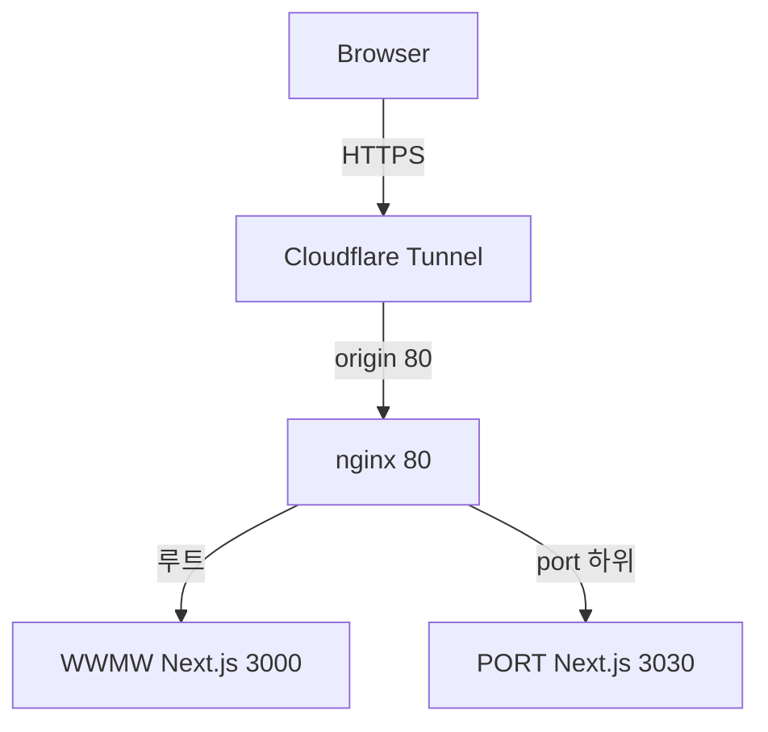
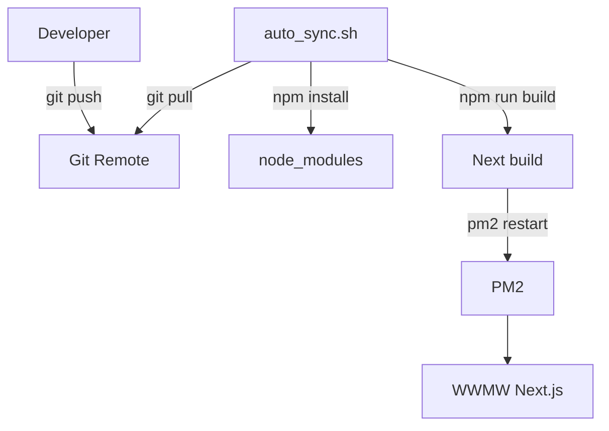
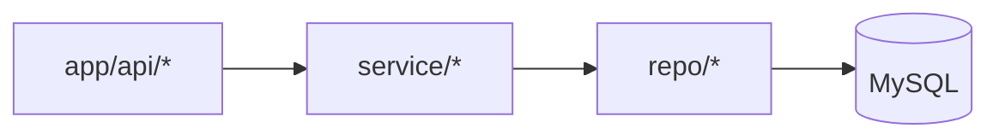

# WWMW - 연운 도구

Next.js 기반 웹 앱. 심법 뽑기, 스무고개족보, 만사록(나사일) 등 게임 연동 도구를 제공합니다.

- **기술 스택**: Next.js 16 (App Router), React 19, TypeScript, Tailwind CSS, MySQL
- **다국어**: 쿠키 `lang` 기반 (ko/en 등), API·UI 공통 적용

---

## 아키텍처 / 설계

### 사용자 요청 경로 (운영)



- **의도**: 외부에서는 도메인 하나만 보되, nginx에서 **경로 기준으로 책임을 분리**합니다.
  - `/` → `wwmw` (Next.js, 예: 3000)
  - `/port` → 포트폴리오 앱(별도 Next.js, 예: 3030, `basePath: "/port"`)

### 배포 루프 (자동 동기화 + PM2)



### 데이터 접근 (MySQL)



---

## 트러블슈팅 / 장애분석

### 1) `/`와 `/port`를 함께 운영하려고 했더니 라우팅이 꼬임

- **증상**: 하나의 도메인에서 `/`(WWMW)와 `/port`(포트폴리오)를 같이 운영하려는데 경로 분기가 애매하거나, 루트(`/`)가 의도치 않게 다른 앱으로만 감.
- **원인**: Cloudflare Tunnel이 nginx가 아니라 **특정 앱 포트(예: 3000 또는 3030)** 를 직접 바라보면, nginx에서 **경로 기반(`/`, `/port`) 분기**를 할 수 없습니다.
- **해결**: Tunnel은 **nginx 80**만 origin으로 고정하고, nginx에서 경로별로 프록시 분기합니다.

### 2) API는 뜨는데 DB만 연결이 안 됨

- **증상**: 페이지는 뜨지만 `/api/db/test`가 실패하거나, 특정 API가 500으로 떨어짐.
- **원인**: `.env.local` DB 설정 누락/오타, MySQL 사용자 권한 부족, 컨테이너/호스트 네트워크 혼동(예: `localhost`가 컨테이너 내부를 가리킴).
- **해결**:
  - `.env.local`의 `MYSQL_HOST/PORT/USER/PASSWORD/DATABASE` 확인
  - MySQL 권한(스키마/테이블 접근) 확인
  - Docker 사용 시 호스트 접근 주소(예: `host.docker.internal` 등) 또는 동일 네트워크 구성 점검

---

## 프로젝트 구조

```
wwe/
├── app/                        # Next.js App Router
│   ├── api/                    # REST API
│   │   ├── db/test/            # DB 연결 테스트
│   │   ├── factions/           # 유파 목록 (다국어)
│   │   ├── innerways/simulator/# 심법 시뮬레이터용
│   │   ├── twenty-questions/   # 스무고개
│   │   ├── uid/                # 방문자 UID 발급·조회
│   │   └── wanderingtales/     # 만사록 목록·상세
│   ├── api-doc/                # Swagger API 문서 페이지
│   ├── builds/                 # 빌드 목록·상세 페이지 (주석 처리됨)
│   ├── simulator/mystic/       # 심법 뽑기 페이지
│   ├── twentyquestions/        # 스무고개 페이지
│   ├── components/             # 공통 컴포넌트 (Header, Footer, Layout, BuildForm 등)
│   ├── providers/              # LanguageProvider, Providers
│   ├── layout.tsx
│   ├── page.tsx                # 메인 (현재 심법 뽑기)
│   └── globals.css
│
├── repo/                       # Repository (DB 접근)
│   ├── T_CodeBase.repository.ts
│   ├── faction.repository.ts
│   ├── innerway.repository.ts
│   ├── twenty-questions.repository.ts
│   ├── uid.repository.ts
│   └── wanderingtales.repository.ts
│
├── service/                    # Service (비즈니스 로직)
│   ├── faction.service.ts
│   ├── innerway.service.ts
│   ├── uid.service.ts
│   └── wanderingtales.service.ts
│
├── types/                      # TypeScript 타입
│   ├── nav.ts
│   ├── wanderingtales.ts
│   ├── innerway.ts
│   ├── twenty-questions.ts
│   └── uid.ts
│
├── lib/                        # 유틸·설정
│   ├── db.ts                   # MySQL 연결 풀 (mysql2)
│   ├── api-response.ts         # 공통 API 응답 (responseOk, responseServerError 등)
│   ├── api-lang.ts             # 요청에서 lang 추출 (쿠키)
│   ├── auth.ts
│   ├── swagger.ts
│   └── lang-validator.ts / lang-cookie-client.ts / uid-cookie-client.ts
│
├── hooks/                      # React 훅
│   ├── useApi.ts
│   ├── useUid.ts
│   ├── useInput.ts
│   └── useHighlight.tsx
│
├── sql/                        # DB 스키마·시드
│   ├── schema_simple.sql       # 단순화 스키마 (T_CodeBase, 빌드보드 등)
│   ├── naesilTable.sql         # 만사록 보드 테이블
│   ├── naesilData.sql          # 만사록 코드·보드 시드
│   ├── function/UDF_BaseCode.sql
│   └── 기타 (무술계층, 이미지 등)
│
├── doc/                        # 문서
│   ├── DEPLOYMENT.md           # 맥미니/PM2/Nginx 배포
│   ├── LANGUAGE_USAGE.md      # 다국어 사용법
│   ├── EXTERNAL_ACCESS.md
│   └── fix-db-permissions.md
│
├── deploy/                     # 배포용
│   ├── Dockerfile              # MySQL 이미지
│   ├── deploy.sh
│   └── auto_sync.sh
│
├── script/                     # 스크립트 (로컬·폴링 배포 등)
│   └── auto_sync.sh            # WWE Next.js + PM2 폴링 자동 동기화
│
├── public/                     # 정적 파일
├── middleware.ts               # lang 쿠키 → x-lang 헤더 등
├── ecosystem.config.js         # PM2 설정
└── next.config.ts / tailwind.config.ts / tsconfig.json
```

### 레이어 요약

| 레이어     | 경로       | 역할                                    |
| ---------- | ---------- | --------------------------------------- |
| API Routes | `app/api/` | HTTP 요청/응답, 쿼리 파라미터·쿠키 처리 |
| Service    | `service/` | 비즈니스 로직, 검증, Repository 호출    |
| Repository | `repo/`    | MySQL 쿼리 (`lib/db` 사용)              |
| Types      | `types/`   | DTO·도메인 타입 정의                    |

---

## 시작하기

### 1. 의존성 설치

```bash
npm install
```

### 2. 환경 변수

프로젝트 루트에 `.env.local` 생성:

```env
MYSQL_HOST=localhost
MYSQL_PORT=3306
MYSQL_USER=wwe_user
MYSQL_PASSWORD=wwe_password
MYSQL_DATABASE=wwe_db
```

**관리자 UID (선택)**  
특정 UID를 관리자로 두려면 (빌드 등 전체 수정/삭제 권한):

```env
ADMIN_UIDS=발급받은-uuid-1,발급받은-uuid-2
```

- uid는 브라우저 접속 후 `POST /api/uid`로 발급
- 비워두면 작성자만 자신 글 수정/삭제 가능

### 3. DB 준비

- MySQL 8 사용. `sql/schema_simple.sql`, `sql/naesilTable.sql`, `sql/naesilData.sql` 등으로 스키마·시드 적용
- Docker 사용 시: `deploy/Dockerfile`로 MySQL 이미지 빌드 후 실행 (자세한 내용은 `doc/DEPLOYMENT.md` 참고)

### 4. 개발 서버 실행

```bash
cd 'F:\Users\user\project\wwmw\'
npm run dev
```

브라우저에서 [http://localhost:3000](http://localhost:3000) 접속.

### 5. DB 연결 확인

[http://localhost:3000/api/db/test](http://localhost:3000/api/db/test) 에서 연결 상태 확인.

---

## 주요 API

| 메서드   | 경로                       | 설명                                             |
| -------- | -------------------------- | ------------------------------------------------ |
| GET      | `/api/db/test`             | DB 연결 테스트                                   |
| GET      | `/api/factions`            | 유파 목록 (다국어, 쿠키 lang)                    |
| GET      | `/api/wanderingtales`      | 만사록 목록 (쿼리: region, subRegion, 쿠키 lang) |
| GET      | `/api/wanderingtales/:id`  | 만사록 상세                                      |
| GET/POST | `/api/uid`                 | UID 조회/발급                                    |
| GET      | `/api/twenty-questions`    | 스무고개                                         |
| GET      | `/api/innerways/simulator` | 심법 시뮬레이터용                                |

- 다국어 API는 쿠키 `lang` 또는 `x-lang` 사용. 자세한 사용법은 `doc/LANGUAGE_USAGE.md` 참고.
- API 문서: 개발 서버 실행 후 [http://localhost:3000/api-doc](http://localhost:3000/api-doc) (Swagger).

---

## 스크립트

| 스크립트                            | 설명                         |
| ----------------------------------- | ---------------------------- |
| `npm run dev`                       | 개발 서버 (Next.js)          |
| `npm run build`                     | 프로덕션 빌드                |
| `npm run start`                     | 프로덕션 서버 실행 (빌드 후) |
| `npm run lint` / `npm run lint:fix` | ESLint                       |
| `npm run type-check`                | TypeScript 검사              |
| `npm run format`                    | Prettier 포맷                |

---

## 배포

- **맥미니·PM2·Nginx**: `doc/DEPLOYMENT.md`
- **폴링 자동 동기화** (Git pull → npm ci → build → PM2 restart): `script/auto_sync.sh` (프로젝트 루트에서 실행)

---

## 참고 문서

- [Next.js Documentation](https://nextjs.org/docs)
- `doc/DEPLOYMENT.md` - 배포 가이드
- `doc/LANGUAGE_USAGE.md` - 다국어(쿠키·API) 사용법
