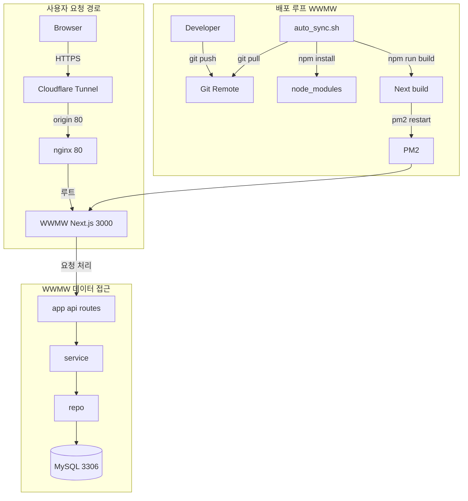

# WWMW - 연운 도구

## 개요

**Next.js** 기반 **연운·게임 연동 도구** 웹 앱입니다. 심법 뽑기, 스무고개족보, 만사록(나사일) 등을 제공합니다.

- **기술 스택**: Next.js · TypeScript · Tailwind CSS · MySQL(3306) · Docker · PM2 · Nginx · Cloudflare Tunnel
- **공개 URL**: [https://wwmw.shop](https://wwmw.shop)

---

## 아키텍처 / 설계

### 기술 스택

| 구분       | 선택                                                                                      |
| ---------- | ----------------------------------------------------------------------------------------- |
| 프레임워크 | Next.js, TypeScript                                                                       |
| 데이터     | MySQL 8 · 기본 포트 **3306** (`MYSQL_PORT`로 변경 가능)                                   |
| API·문서   | REST, Swagger                                                                             |
| 콘텐츠     | MDX , `remark-gfm`, rehype                                                                |
| 배포·운영  | Node 서버 (next start), PM2로 상시 실행; MySQL은 Docker 등 별도 구성(일반적으로 **3306**) |

### 설계 의도

- **Next.js 선택 이유**: 화면과 **REST API(`app/api`)** 를 한 레포에서 다루어 **배포 단위와 코드 탐색**을 단순하게 유지할 수 있음.
- **TypeScript 선택 이유**: API·Service·Repository·도메인 타입을 맞춰 **요청/응답·DB 매핑**에서 실수를 줄이고, 리팩터링 시 영향 범위를 추적하기 쉬움.
- **MySQL + mysql2 선택 이유**:
  - **도메인 데이터**: 유파·만사록·UID 등 **관계형으로 두기 자연스러운 데이터**를 테이블로 관리하고, `mysql2` **연결 풀**로 안정적으로 쿼리할 수 있음.
  - **다국어**: 언어별 문구·콘텐츠를 **DB에 두고 `lang` 기준으로 조회**해 API 응답 규칙을 한곳에서 맞추기 위해 RDB를 사용함.
  - **SQL Server 대비**: 맥미니 한 대에서 Node와 DB를 같이 돌릴 때 **기본 메모리·운영 부담이 상대적으로 작은 편인 조합**으로 가져가기 쉬워 MySQL을 택함. (워크로드·에디션에 따라 달라질 수 있음.)
- **REST + Swagger 선택 이유**: 클라이언트·외부 소비자와 **HTTP 계약**을 명확히 하고, Swagger로 **API 문서를 함께 유지**할 수 있음.
- **MDX + remark/rehype 선택 이유**: 공지·가이드·블로그 성격의 콘텐츠를 **코드와 가까운 형태**로 작성·버전 관리할 수 있음.
- **다국어(앱 계층, 쿠키 `lang`)**: 브라우저의 `lang`을 **미들웨어·헤더**로 API에 넘겨 **DB의 언어별 데이터**와 맞물리게 함. (자세한 사용은 `doc/LANGUAGE_USAGE.md` 참고.)
- **Docker(MySQL)**: 로컬·서버에서 **DB 스키마·시드를 재현**하기 쉽게 함.
- **운영(PM2 · Nginx · Cloudflare Tunnel)**: Node는 **PM2**로 상시 실행·재시작, 같은 머신에서 **경로별 분기**는 **Nginx**, 외부 HTTPS·터널은 **Cloudflare**로 역할을 나눔.

### 아키텍처 다이어그램



- **경로 매핑(요약)**:
  - `/` → `localhost:3000` (WWMW)
  - `/port` → `localhost:3030` (포트폴리오, `basePath: "/port"`)

---

## 트러블슈팅

### 장애분석 사례 1) `/`와 `/port`를 함께 운영하려고 했더니 라우팅이 꼬임

- **증상**: 하나의 도메인에서 `wwmw.shop`(WWMW)와 `wwmw.shop/port`(포트폴리오)를 같이 운영하려는데 터널·프록시 구성이 애매해 경로 분기가 불안정하거나, 루트(`/`)가 의도치 않게 한쪽 앱으로만 감.
- **원인**: Cloudflare Tunnel이 nginx 앞단이 아니라 **특정 앱 포트(3000 또는 3030)** 를 직접 바라보면, nginx에서 **경로 기반(`/`, `/port`) 분기**를 할 수 없고 **도메인 루트(`/`)가 그 앱의 `/`에만** 종속됨.
- **해결**: Cloudflare Tunnel의 origin을 **nginx(:80)** 로 고정하고, nginx에서 경로별 프록시로 분리.
  - `/` → `localhost:3000`
  - `/port` → `localhost:3030`

### 장애분석 사례 2) MySQL `Access denied` 및 DB 연결 실패

- **증상**: `/api/db/test`가 실패하거나 DB를 쓰는 API가 500. 로그에 `Access denied for user 'wwe_user'@'%' to database 'wwe_db'` 가 찍힘.
- **원인**: `wwe_user`에게 `wwe_db` 권한이 없었음.
- **해결**: Docker 컨테이너에서 root로 들어가 `GRANT`로 권한을 줌. 배포 후에는 앞단 프록시·환경에 맞춰 접속하고, 로컬 **dev**에서는 `localhost:3306` 등으로 앱에서 DB에 직접 붙이는 방식으로 맞춤.

### 장애분석 사례 3) 다국어 코드 테이블(복합 PK) 때문에 FK를 못 걸었던 이슈

- **증상**: `T_CodeBase(code, lang)`를 다국어 기준 테이블로 두고 나니, 다른 테이블에서 `code`만으로는 참조(FK)를 걸 수 없어 스키마 설계가 꼬이거나, 무리하게 FK를 걸면 마이그레이션 단계에서 에러가 남.
- **원인**: `T_CodeBase`의 PK가 `(code, lang)` **복합키**라서, 예를 들어 `유파_code`처럼 **`code` 단일 컬럼**만으로는 FK를 만들 수 없음.
- **해결**: `code` 참조는 FK 대신 **INDEX + 쿼리 규칙**으로 일관성을 맞춤.
  - 다국어 표기는 `UDF_BaseCode(code, lang)`로 변환해 사용.
  - 조회 성능은 `idx_code` 등 인덱스로 보장.

### 장애분석 사례 4) 다국어 조회에서 collation/charset 문제로 함수·쿼리가 깨짐

- **증상**: 다국어 문자열 비교/함수 호출에서 에러가 나거나, 언어별로 값이 깨져 보이는 문제가 발생.
- **원인**: MySQL에서 `utf8mb4`/`collation`이 섞이면 비교·조인·함수 생성 단계에서 충돌이 날 수 있음.
- **해결**: DB 스키마와 함수에 `utf8mb4` + `utf8mb4_unicode_ci`를 **명시적으로 고정**.
  - 스키마: `DEFAULT CHARSET=utf8mb4 COLLATE=utf8mb4_unicode_ci`
  - 함수: 파라미터/반환 타입에도 `CHARACTER SET`/`COLLATE`를 명시

---

## 프로젝트 구조

```
wwe/
├── app/                        # Next.js App Router
│   ├── api/                    # REST API
│   │   ├── db/test/            # DB 연결 테스트
│   │   ├── factions/           # 유파 목록 (다국어)
│   │   ├── innerways/simulator/# 심법 시뮬레이터용
│   │   ├── twenty-questions/   # 스무고개
│   │   ├── uid/                # 방문자 UID 발급·조회
│   │   └── wanderingtales/     # 만사록 목록·상세
│   ├── api-doc/                # Swagger API 문서 페이지
│   ├── builds/                 # 빌드 목록·상세 페이지 (주석 처리됨)
│   ├── simulator/mystic/       # 심법 뽑기 페이지
│   ├── twentyquestions/        # 스무고개 페이지
│   ├── components/             # 공통 컴포넌트 (Header, Footer, Layout, BuildForm 등)
│   ├── providers/              # LanguageProvider, Providers
│   ├── layout.tsx
│   ├── page.tsx                # 메인 (현재 심법 뽑기)
│   └── globals.css
│
├── repo/                       # Repository (DB 접근)
│   ├── T_CodeBase.repository.ts
│   ├── faction.repository.ts
│   ├── innerway.repository.ts
│   ├── twenty-questions.repository.ts
│   ├── uid.repository.ts
│   └── wanderingtales.repository.ts
│
├── service/                    # Service (비즈니스 로직)
│   ├── faction.service.ts
│   ├── innerway.service.ts
│   ├── uid.service.ts
│   └── wanderingtales.service.ts
│
├── types/                      # TypeScript 타입
│   ├── nav.ts
│   ├── wanderingtales.ts
│   ├── innerway.ts
│   ├── twenty-questions.ts
│   └── uid.ts
│
├── lib/                        # 유틸·설정
│   ├── db.ts                   # MySQL 연결 풀 (mysql2)
│   ├── api-response.ts         # 공통 API 응답 (responseOk, responseServerError 등)
│   ├── api-lang.ts             # 요청에서 lang 추출 (쿠키)
│   ├── auth.ts
│   ├── swagger.ts
│   └── lang-validator.ts / lang-cookie-client.ts / uid-cookie-client.ts
│
├── hooks/                      # React 훅
│   ├── useApi.ts
│   ├── useUid.ts
│   ├── useInput.ts
│   └── useHighlight.tsx
│
├── sql/                        # DB 스키마·시드
│   ├── schema_simple.sql       # 단순화 스키마 (T_CodeBase, 빌드보드 등)
│   ├── naesilTable.sql         # 만사록 보드 테이블
│   ├── naesilData.sql          # 만사록 코드·보드 시드
│   ├── function/UDF_BaseCode.sql
│   └── 기타 (무술계층, 이미지 등)
│
├── doc/                        # 문서
│   ├── DEPLOYMENT.md           # 맥미니/PM2/Nginx 배포
│   ├── LANGUAGE_USAGE.md      # 다국어 사용법
│   ├── EXTERNAL_ACCESS.md
│   └── fix-db-permissions.md
│
├── deploy/                     # 배포용
│   ├── Dockerfile              # MySQL 이미지
│   ├── deploy.sh
│   └── auto_sync.sh
│
├── script/                     # 스크립트 (로컬·폴링 배포 등)
│   └── auto_sync.sh            # WWE Next.js + PM2 폴링 자동 동기화
│
├── public/                     # 정적 파일
├── middleware.ts               # lang 쿠키 → x-lang 헤더 등
├── ecosystem.config.js         # PM2 설정
└── next.config.ts / tailwind.config.ts / tsconfig.json
```

### 레이어 요약

| 레이어     | 경로       | 역할                                    |
| ---------- | ---------- | --------------------------------------- |
| API Routes | `app/api/` | HTTP 요청/응답, 쿼리 파라미터·쿠키 처리 |
| Service    | `service/` | 비즈니스 로직, 검증, Repository 호출    |
| Repository | `repo/`    | MySQL 쿼리 (`lib/db` 사용)              |
| Types      | `types/`   | DTO·도메인 타입 정의                    |

---

## Getting Started (Development)

### 1. 의존성 설치

```bash
npm install
```

### 2. 환경 변수

프로젝트 루트에 `.env.local` 생성:

```env
MYSQL_HOST=localhost
MYSQL_PORT=3306
MYSQL_USER=wwe_user
MYSQL_PASSWORD=wwe_password
MYSQL_DATABASE=wwe_db
```

**관리자 UID (선택)**  
특정 UID를 관리자로 두려면 (빌드 등 전체 수정/삭제 권한):

```env
ADMIN_UIDS=발급받은-uuid-1,발급받은-uuid-2
```

- uid는 브라우저 접속 후 `POST /api/uid`로 발급
- 비워두면 작성자만 자신 글 수정/삭제 가능

### 3. DB 준비

- MySQL 8 사용. `sql/schema_simple.sql`, `sql/naesilTable.sql`, `sql/naesilData.sql` 등으로 스키마·시드 적용.
- Docker 사용 시: `deploy/Dockerfile`로 MySQL 이미지 빌드 후 실행 ([`doc/DEPLOYMENT.md`](doc/DEPLOYMENT.md) 참고).

### 4. 개발 서버 실행

프로젝트 루트에서:

```bash
cd 'F:\Users\user\project\wwmw\'
npm run dev
```

브라우저에서 [http://localhost:3000](http://localhost:3000) 로 접속.

### 5. DB 연결 확인

[http://localhost:3000/api/db/test](http://localhost:3000/api/db/test) 에서 연결 상태를 확인합니다.

---

## 주요 API

| 메서드   | 경로                       | 설명                                             |
| -------- | -------------------------- | ------------------------------------------------ |
| GET      | `/api/db/test`             | DB 연결 테스트                                   |
| GET      | `/api/factions`            | 유파 목록 (다국어, 쿠키 lang)                    |
| GET      | `/api/wanderingtales`      | 만사록 목록 (쿼리: region, subRegion, 쿠키 lang) |
| GET      | `/api/wanderingtales/:id`  | 만사록 상세                                      |
| GET/POST | `/api/uid`                 | UID 조회/발급                                    |
| GET      | `/api/twenty-questions`    | 스무고개                                         |
| GET      | `/api/innerways/simulator` | 심법 시뮬레이터용                                |

- 다국어 API는 쿠키 `lang` 또는 `x-lang` 사용. 자세한 사용법은 [`doc/LANGUAGE_USAGE.md`](doc/LANGUAGE_USAGE.md) 참고.
- API 문서: 개발 서버 실행 후 [http://localhost:3000/api-doc](http://localhost:3000/api-doc) (Swagger).

---

## 스크립트

| 스크립트                            | 설명                         |
| ----------------------------------- | ---------------------------- |
| `npm run dev`                       | 개발 서버 (Next.js)          |
| `npm run build`                     | 프로덕션 빌드                |
| `npm run start`                     | 프로덕션 서버 실행 (빌드 후) |
| `npm run lint` / `npm run lint:fix` | ESLint                       |
| `npm run type-check`                | TypeScript 검사              |
| `npm run format`                    | Prettier 포맷                |

---

## 배포

- **맥미니·PM2·Nginx**: [`doc/DEPLOYMENT.md`](doc/DEPLOYMENT.md)
- **폴링 자동 동기화** (Git pull → install → build → PM2 restart): 프로젝트 루트에서 `script/auto_sync.sh` (Linux/macOS 전제, 자세한 내용은 `doc/DEPLOYMENT.md`)

---

## 참고 문서

- [Next.js Documentation](https://nextjs.org/docs)
- [`doc/DEPLOYMENT.md`](doc/DEPLOYMENT.md) — 배포 가이드
- [`doc/LANGUAGE_USAGE.md`](doc/LANGUAGE_USAGE.md) — 다국어(쿠키·API)
- [`doc/EXTERNAL_ACCESS.md`](doc/EXTERNAL_ACCESS.md) — 외부 접속·보안
- [`doc/fix-db-permissions.md`](doc/fix-db-permissions.md) — MySQL 권한·연결
